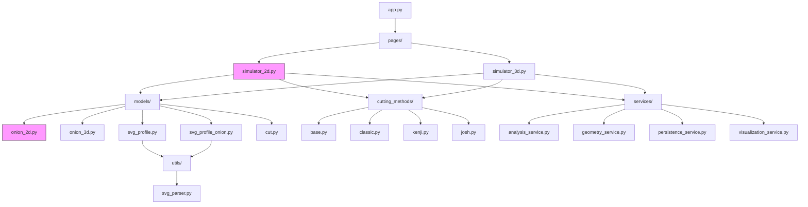
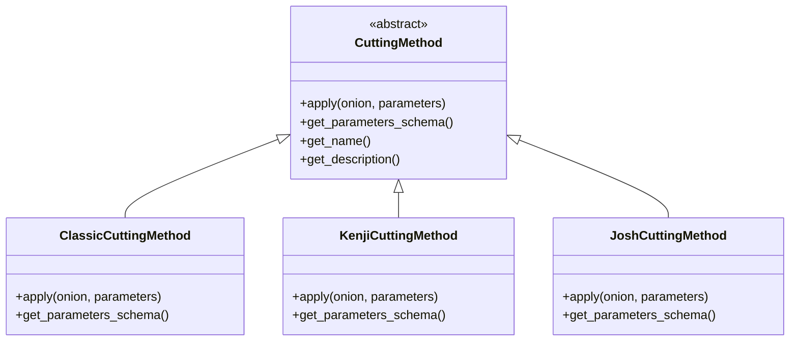
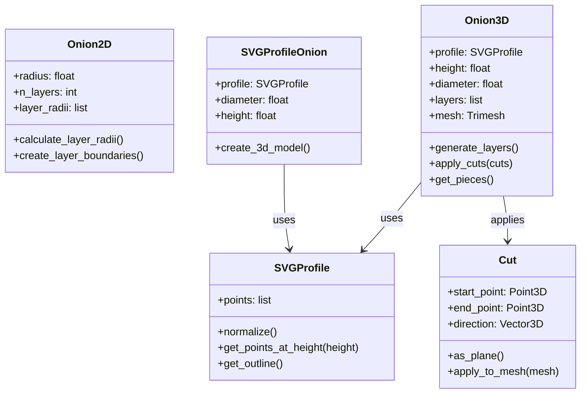
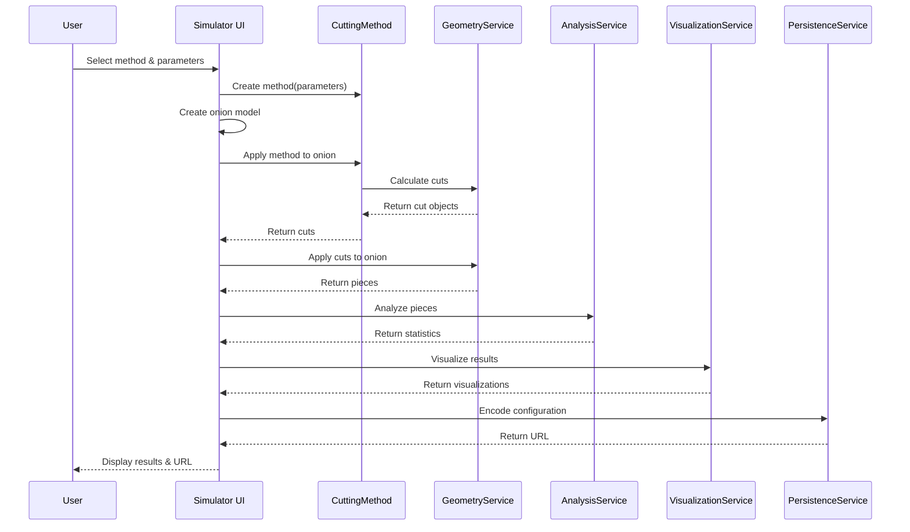

# Onion Simulator: System Patterns

## System Architecture

The Onion Simulator employs a modular architecture that separates concerns while maintaining clean interfaces between components. The system is built using the following architectural patterns:

### Multi-Page Streamlit Application

The application is built on Streamlit, with multiple pages for different simulators:
- `app.py`: Main entry point and navigation
- `pages/simulator_2d.py`: Legacy 2D simulation interface
- `pages/simulator_3d.py`: Current 3D simulation interface

### Domain-Driven Design Influences

The codebase is organized around domain concepts rather than technical layers:



## Key Design Patterns

### Strategy Pattern: Cutting Methods

The cutting methods are implemented using the Strategy pattern, allowing different cutting algorithms to be used interchangeably:



### Factory Pattern: Method Creation

The `CuttingMethodFactory` creates instances of specific cutting methods based on name:

```python
class CuttingMethodFactory:
    @staticmethod
    def create(method_name, **kwargs):
        if method_name == "classic":
            return ClassicCuttingMethod(**kwargs)
        elif method_name == "kenji":
            return KenjiCuttingMethod(**kwargs)
        elif method_name == "josh":
            return JoshCuttingMethod(**kwargs)
        else:
            raise ValueError(f"Unknown cutting method: {method_name}")
```

### Service Pattern: Domain Operations

Services encapsulate related functionality and provide a clean API for domain operations:

- `GeometryService`: Handles geometric calculations (intersections, volumes)
- `AnalysisService`: Analyzes results (statistics, piece distribution)
- `VisualizationService`: Creates visualizations of onions and cuts
- `PersistenceService`: Manages state persistence and URL generation

### Builder Pattern: Onion Construction

The 3D onion models use a builder-like pattern for progressive construction:

```python
onion = Onion3D()
onion.set_profile(svg_profile)
onion.set_parameters(diameter=5.0, height=4.0)
onion.generate_layers(n_layers=10)
onion.finalize()
```

## Component Relationships

### Model Relationships



### Service Interactions



## Data Flow Architecture

The data flow through the system follows a clear pattern:

1. **Configuration**: User selects parameters through the UI
2. **Model Creation**: Onion model is instantiated based on parameters
3. **Method Application**: Selected cutting method generates cuts
4. **Geometric Processing**: Cuts are applied to the onion model
5. **Analysis**: Resulting pieces are analyzed for metrics
6. **Visualization**: Results are visualized for the user
7. **Persistence**: Configuration is encoded for sharing

### Key Data Structures

- **Onion Models**: Represent the onion geometry (2D polygons or 3D mesh)
- **Cuts**: Represent cutting planes or lines through the onion
- **Pieces**: Resulting fragments after cuts are applied
- **Statistics**: Metrics about the pieces (size distribution, uniformity)
- **Visualizations**: Visual representations for the UI

## Error Handling Approach

The system uses structured exception handling:

```python
try:
    # Operation that might fail
    result = operation()
except GeometryError as e:
    # Handle specific geometry errors
    logger.error(f"Geometry error: {str(e)}")
    st.error("There was a problem with the geometry calculation.")
except ValueError as e:
    # Handle validation errors
    logger.warning(f"Invalid input: {str(e)}")
    st.warning(f"Please check your inputs: {str(e)}")
except Exception as e:
    # Catch-all for unexpected errors
    logger.exception(f"Unexpected error: {str(e)}")
    st.error("An unexpected error occurred. Please try again.")
```

## Event System

The core `events.py` module implements a lightweight event system for component communication:

```python
# Publishing an event
EventBus.publish("onion_cut_applied", {
    "onion_id": onion.id,
    "cut_method": method.name,
    "cut_count": len(cuts),
    "piece_count": len(pieces)
})

# Subscribing to an event
@EventBus.subscribe("onion_cut_applied")
def log_cut_application(event_data):
    logger.info(f"Cut applied: {event_data['cut_method']} " +
                f"with {event_data['cut_count']} cuts " +
                f"resulting in {event_data['piece_count']} pieces")
```

## Performance Patterns

### Caching

Computationally expensive operations use Streamlit's caching:

```python
@st.cache_data
def apply_cuts_to_onion(onion, cuts, method_name):
    # Expensive operation
    return pieces
```

### Progressive Loading

3D visualizations should (but don't currently) use progressive loading techniques to maintain responsiveness:

1. Show wireframe model first
2. Add surface details progressively
3. Apply advanced lighting last 